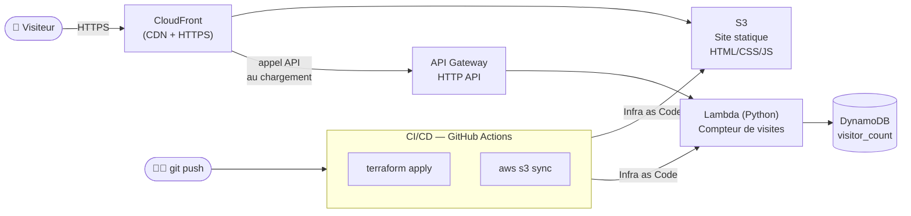

# Cloud Resume Challenge — Infrastructure Serverless Full-Stack

[](https://www.terraform.io/)
[](https://aws.amazon.com/)
[](https://github.com/features/actions)
[]()

## Objectif du projet

Implémentation du [**Cloud Resume Challenge**](https://cloudresumechallenge.dev/), un défi
open-source reconnu dans la communauté cloud, consistant à héberger son CV en ligne sur une
architecture **100 % serverless**, avec un compteur de visiteurs et un déploiement **CI/CD**
entièrement automatisé.

> 💡 Ce projet suit le format public du Cloud Resume Challenge (créé par Forrest Brazeal).
> L'implémentation, le code Terraform, le backend Lambda et le pipeline CI/CD ci-dessous
> sont ma réalisation personnelle du challenge.

## Architecture



### Composants clés

| Composant | Rôle |
|---|---|
| **S3 + CloudFront** | Hébergement du frontend statique, HTTPS via CloudFront, OAC (Origin Access Control) |
| **API Gateway (HTTP API)** | Expose l'endpoint `GET /count` |
| **AWS Lambda (Python)** | Incrémente et retourne le compteur de visites |
| **DynamoDB** | Stocke le compteur de visiteurs (mode PAY_PER_REQUEST) |
| **Terraform** | Infrastructure 100 % as Code (aucune action manuelle console) |
| **GitHub Actions** | Pipeline CI/CD : `terraform apply` + synchronisation du frontend à chaque push sur `main` |

## Structure du dépôt

```
.
├── frontend/
│   ├── index.html
│   ├── style.css
│   └── script.js
├── backend/
│   └── lambda_function.py
├── terraform/
│   ├── versions.tf
│   ├── variables.tf
│   ├── main.tf
│   └── outputs.tf
├── .github/workflows/
│   └── deploy.yml         # Pipeline CI/CD
└── README.md
```

## Déploiement

### 1. Déploiement manuel (première fois / test local)

```bash
git clone https://github.com/BakirAhmed/cloud-resume-challenge.git
cd cloud-resume-challenge/terraform

terraform init
terraform apply

# Récupérer l'URL de l'API et l'injecter dans le frontend
terraform output api_endpoint
```

Mettre à jour `API_URL` dans `frontend/script.js`, puis synchroniser le site :

```bash
aws s3 sync ../frontend s3://$(terraform output -raw s3_bucket_name) --delete
```

### 2. Déploiement automatique (CI/CD)

Le workflow `.github/workflows/deploy.yml` se déclenche à chaque `push` sur `main` :
1. `terraform apply` (mise à jour de l'infrastructure)
2. Synchronisation du dossier `frontend/` vers S3

Configurer dans les **secrets GitHub** du dépôt :
- `AWS_ROLE_ARN` : rôle IAM assumable via OIDC (GitHub → AWS), pour éviter de stocker des clés d'accès statiques.

## Points techniques abordés

- Architecture **100 % serverless** (aucun serveur à gérer)
- **CloudFront + OAC** pour sécuriser l'accès au bucket S3 (pas d'accès public direct)
- API **HTTP API Gateway** (plus légère et moins chère qu'une REST API classique)
- Infrastructure **entièrement codée en Terraform**
- Pipeline **CI/CD GitHub Actions** avec authentification OIDC (sans clés statiques)
- Séparation claire frontend / backend / infrastructure

## Améliorations futures

- [ ] Nom de domaine personnalisé + certificat ACM (`ahmedbakir.dev`)
- [ ] Tests unitaires du Lambda (pytest + moto pour mocker DynamoDB)
- [ ] Étape de tests dans le pipeline CI avant `terraform apply`
- [ ] Observabilité : dashboard CloudWatch + alarme sur erreurs Lambda

## Auteur

**Ahmed Bakir** — Étudiant Ingénieur Réseaux & Cloud (EPSI Lyon / ENIG)
[LinkedIn](https://linkedin.com/in/ahmed-bk) · [GitHub](https://github.com/BakirAhmed)
